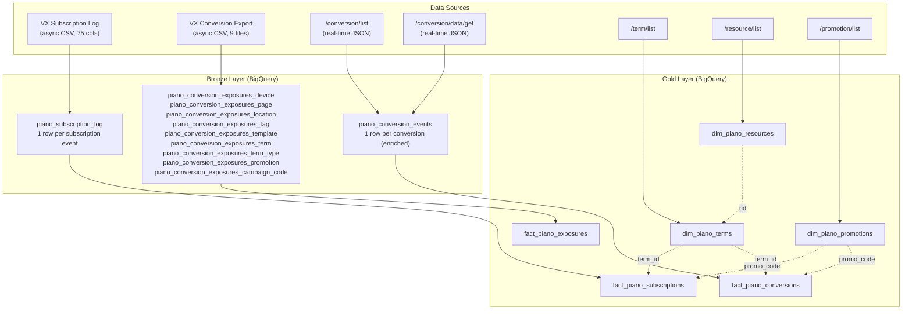
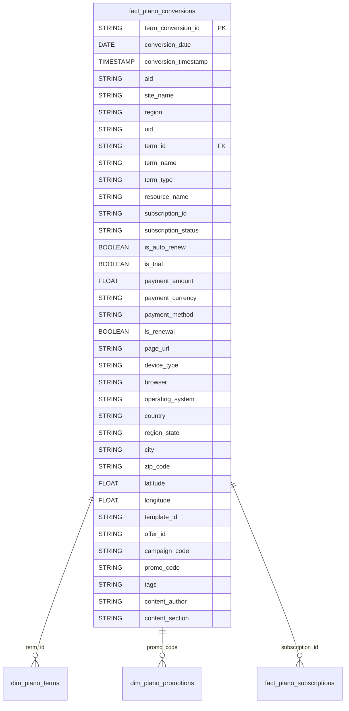
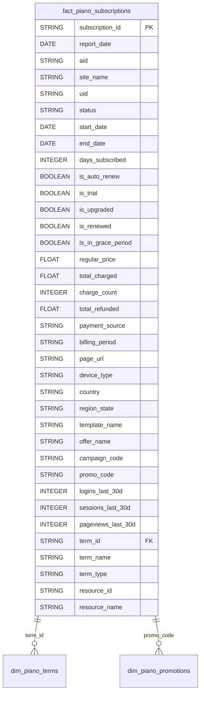
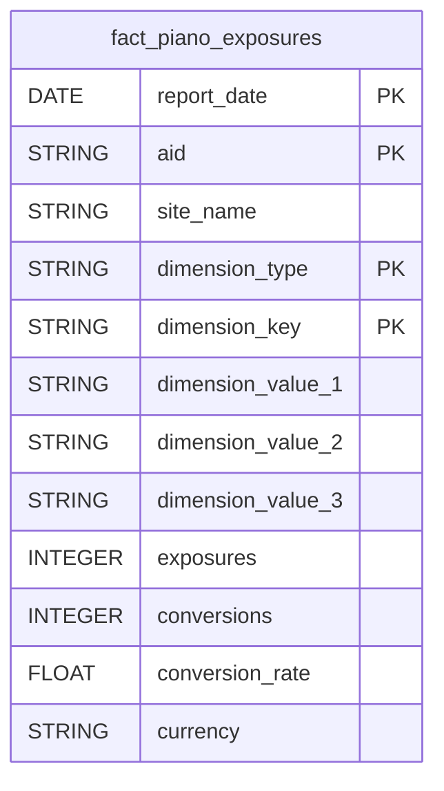
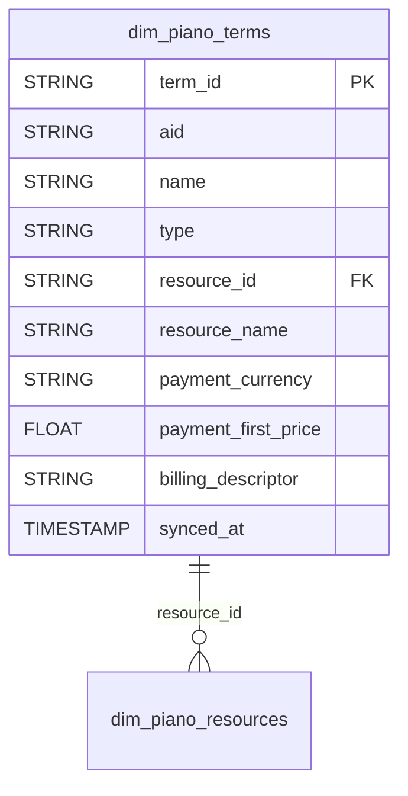
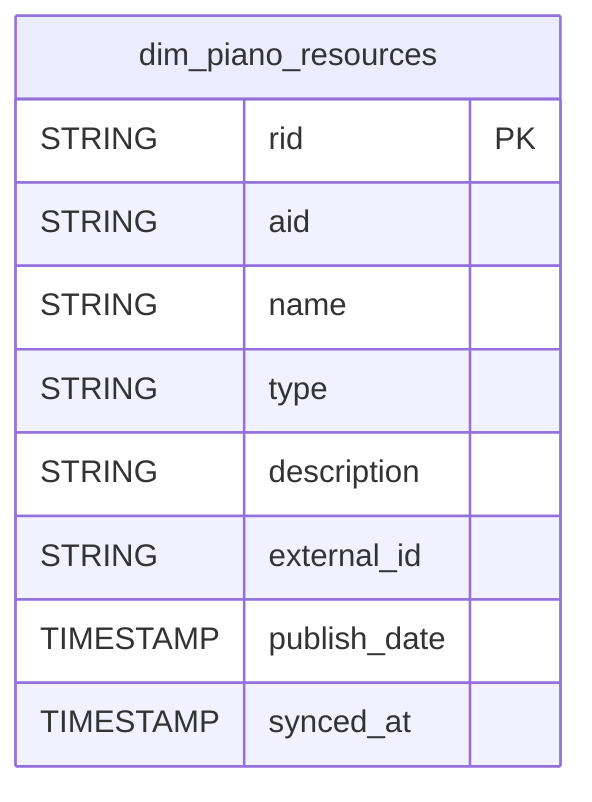
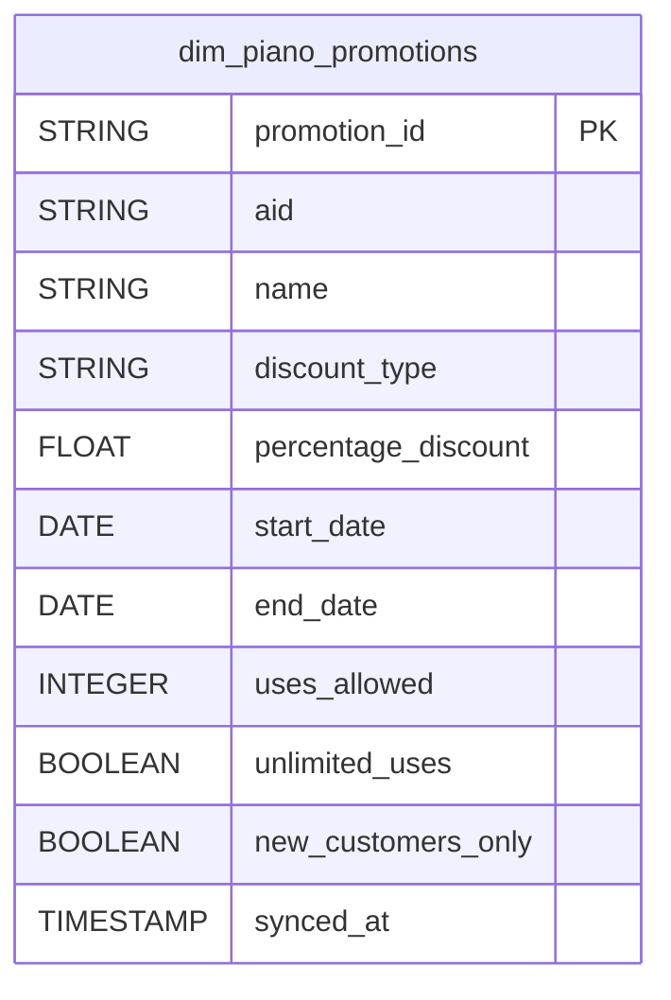

# Piano Data Architecture

> Bronze and Gold layer design for Piano reporting data in BigQuery.
> Dimension tables live in Gold only. Bronze holds raw/lightly-transformed event data.

## High-Level Architecture



---

## Bronze Layer

The bronze layer stores data as close to the source as possible, with only minimal transformations:
- Column name normalization (snake_case)
- Timezone offset stripping from timestamps
- Boolean string-to-bool casting
- Addition of metadata columns (`report_date`, `region`, `site_name`, `ingested_at`, `batch`)

### Bronze Table: `piano_subscription_log`

**Source:** VX Subscription Log export
**Grain:** 1 row per subscription event per day
**Load pattern:** Daily append, partitioned by `report_date`

Contains all 75+ columns from the subscription log CSV (see DATA_SOURCES.md for full list). Key columns:

- `subscription_id` (STRING) -- natural key
- `subscription_status` (STRING) -- Active / Cancelled / etc.
- `term_id`, `term_name`, `term_type` -- what was subscribed to
- `user_id_uid`, `user_email` -- who
- `device`, `url`, `conversion_country` -- behavioral context
- `total_charged`, `charge_count`, `payment_source` -- revenue
- `template_id`, `template_name`, `offer_id`, `offer_name` -- attribution
- `report_date` (DATE), `region` (STRING), `site_name` (STRING), `ingested_at` (TIMESTAMP) -- metadata

### Bronze Table: `piano_conversion_events`

**Source:** `/conversion/list` enriched with `/conversion/data/get`
**Grain:** 1 row per conversion event
**Load pattern:** Daily append, partitioned by `report_date`

This is NEW. It replaces the need to query the 9 aggregate CSVs for conversion-level analysis, while providing user identity and payment details.

Key columns:

- `term_conversion_id` (STRING) -- primary key
- `type` (STRING) -- Registration / Dynamic
- `create_date` (TIMESTAMP) -- exact conversion time
- `uid`, `user_email`, `user_first_name`, `user_last_name` -- who
- `term_id`, `term_name`, `term_type` -- what
- `subscription_id`, `subscription_status`, `subscription_auto_renew` -- subscription lifecycle
- `payment_amount`, `payment_currency`, `payment_method` -- revenue
- `url`, `browser`, `platform`, `operating_system` -- behavioral (from /data/get)
- `user_country`, `user_region`, `user_city`, `zip`, `latitude`, `longitude` -- location (from /data/get)
- `tags`, `template_id`, `offer_id`, `offer_template_id`, `campaigns` -- attribution (from /data/get)
- `content_author`, `content_section`, `content_created` -- content metadata (from /data/get)
- `promo_code` -- promotion
- `report_date`, `region`, `site_name`, `ingested_at` -- metadata

### Bronze Tables: `piano_conversion_exposures_*` (9 tables)

**Source:** VX Conversion Export (9 aggregate CSVs)
**Grain:** 1 row per dimension value (aggregated)
**Load pattern:** Daily append, partitioned by `report_date`

These tables keep their current structure but are renamed with `_exposures_` to clarify they contain **aggregate metrics with Exposures counts**, not individual events.

| Current Table Name | New Table Name |
|-------------------|----------------|
| `piano_reports_conversion_device` | `piano_conversion_exposures_device` |
| `piano_reports_conversion_page` | `piano_conversion_exposures_page` |
| `piano_reports_conversion_location` | `piano_conversion_exposures_location` |
| `piano_reports_conversion_tag` | `piano_conversion_exposures_tag` |
| `piano_reports_conversion_template` | `piano_conversion_exposures_template` |
| `piano_reports_conversion_term` | `piano_conversion_exposures_term` |
| `piano_reports_conversion_term_type` | `piano_conversion_exposures_term_type` |
| `piano_reports_conversion_promotion` | `piano_conversion_exposures_promotion` |
| `piano_reports_conversion_campaign_code` | `piano_conversion_exposures_campaign_code` |

---

## Gold Layer

The gold layer contains cleaned, deduplicated, business-ready tables with resolved IDs.

### Fact Table: `fact_piano_conversions`

**Source:** `bronze.piano_conversion_events`
**Grain:** 1 row per unique conversion
**Deduplication:** By `term_conversion_id`



### Fact Table: `fact_piano_subscriptions`

**Source:** `bronze.piano_subscription_log`
**Grain:** 1 row per subscription (latest state per day)
**Deduplication:** By `subscription_id` + `report_date`



### Fact Table: `fact_piano_exposures`

**Source:** 9 `bronze.piano_conversion_exposures_*` tables
**Grain:** 1 row per dimension_type + dimension_value per report_date
**Design:** Pivots the 9 separate tables into one unified table



Where `dimension_type` is one of: `device`, `page`, `location`, `tag`, `template`, `term`, `term_type`, `promotion`, `campaign_code`.

For example, a device row: `dimension_type=device`, `dimension_value_1=mobile`, `dimension_value_2=android`, `dimension_value_3=chrome`.

### Dimension Table: `dim_piano_terms`

**Source:** `/api/v3/publisher/term/list`
**Refresh:** Weekly (or on-demand)



### Dimension Table: `dim_piano_resources`

**Source:** `/api/v3/publisher/resource/list`
**Refresh:** Weekly (or on-demand)



### Dimension Table: `dim_piano_promotions`

**Source:** `/api/v3/publisher/promotion/list`
**Refresh:** Weekly (or on-demand)



---

## Data Flow Timeline

```mermaid
gantt
    title Daily Pipeline Schedule
    dateFormat HH:mm
    axisFormat %H:%M

    section VX Exports
    Create subscription log job     :s1, 02:00, 1m
    Create conversion export job    :s2, 02:01, 1m
    Poll until ready               :s3, after s2, 5m
    Download and upload to GCS     :s4, after s3, 3m

    section Publisher API
    Fetch /conversion/list         :a1, after s4, 2m
    Enrich with /conversion/data/get :a2, after a1, 5m

    section Load to BQ
    Load subscription_log to bronze :b1, after s4, 2m
    Load conversion_events to bronze :b2, after a2, 2m
    Load exposure CSVs to bronze   :b3, after s4, 2m

    section Gold transforms
    Transform to fact tables       :g1, after b2, 3m

    section Weekly
    Sync dim_terms                 :w1, 06:00, 1m
    Sync dim_resources             :w2, 06:01, 1m
    Sync dim_promotions            :w3, 06:02, 1m
```



---

## BigQuery Dataset Organization

```
project: hmm-hmi-piano-reporting (prod) / hmm-hmi-data-feature (dev)

bronze dataset:
  ├── piano_subscription_log
  ├── piano_conversion_events          (NEW)
  ├── piano_conversion_exposures_device
  ├── piano_conversion_exposures_page
  ├── piano_conversion_exposures_location
  ├── piano_conversion_exposures_tag
  ├── piano_conversion_exposures_template
  ├── piano_conversion_exposures_term
  ├── piano_conversion_exposures_term_type
  ├── piano_conversion_exposures_promotion
  └── piano_conversion_exposures_campaign_code

gold dataset:
  ├── fact_piano_conversions           (NEW)
  ├── fact_piano_subscriptions         (NEW)
  ├── fact_piano_exposures             (NEW)
  ├── dim_piano_terms                  (NEW)
  ├── dim_piano_resources              (NEW)
  └── dim_piano_promotions             (NEW)
```
