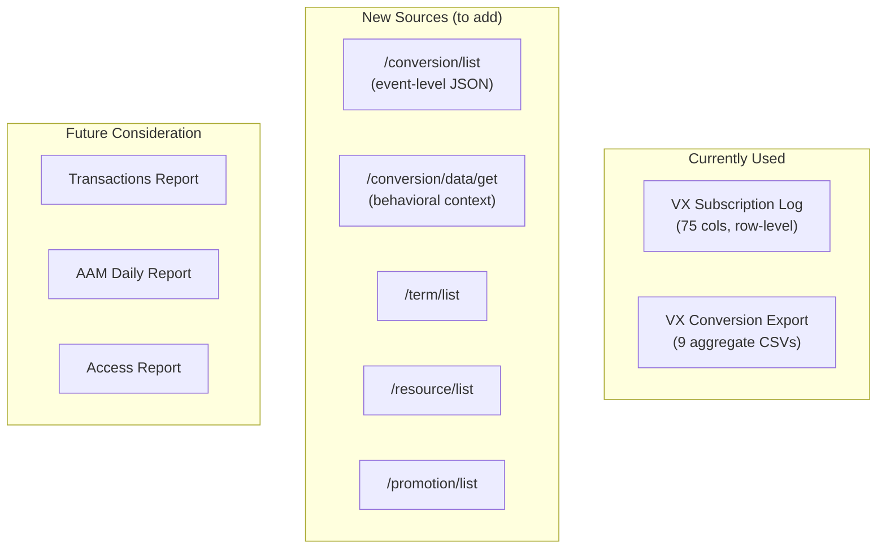

# Piano Data Sources Inventory

> Complete inventory of every data source, what fields each provides, what is missing from each, and what is new with the enrichment approach.

## Table of Contents

- [Source Overview](#source-overview)
- [Source 1: VX Subscription Log Export](#source-1-vx-subscription-log-export)
- [Source 2: VX Conversion Export (9 CSVs)](#source-2-vx-conversion-export-9-csvs)
- [Source 3: /conversion/list API](#source-3-conversionlist-api)
- [Source 4: /conversion/data/get API (NEW)](#source-4-conversiondataget-api-new)
- [Source 5: Dimension Endpoints](#source-5-dimension-endpoints)
- [Source 6: Additional Export Endpoints](#source-6-additional-export-endpoints)
- [What Is Missing From Each Source](#what-is-missing-from-each-source)
- [What Is NEW With the Enrichment Approach](#what-is-new-with-the-enrichment-approach)

---

## Source Overview

| Source | Type | Granularity | Records/day (approx) | Status |
|--------|------|-------------|----------------------|--------|
| VX Subscription Log | Async CSV | 1 row per subscription event | ~2,900 (Quest) | **In production** |
| VX Conversion Export | Async CSV | Aggregated by dimension | 9 files, ~500 rows total | **In production** |
| `/conversion/list` | Real-time JSON | 1 row per conversion event | 13–59/day (Cosmopolitan, varies) | **Verified in production** |
| `/conversion/data/get` | Real-time JSON | 1 row per conversion | Same as above | **Verified in production** |
| `/term/list` | Real-time JSON | 1 row per term | 1 (Cosmopolitan) | **Verified in production** |
| `/resource/list` | Real-time JSON | 1 row per resource | 1 (Cosmopolitan) | **Verified in production** |
| `/promotion/list` | Real-time JSON | 1 row per promotion | 0 (Cosmopolitan) | **Endpoint verified, no data** |

---

## Source 1: VX Subscription Log Export

**Endpoint:** `POST reports-api.piano.io/rest/export/schedule/vx/subscriptionLog`
**Output:** Single CSV file, 1 row per subscription event
**Richness:** The single most complete source (75 columns)

### All 75 Columns

| # | Column | Type | Example |
|---|--------|------|---------|
| 1 | Subscription ID | STRING | RCJFGP1JCCAT |
| 2 | Summary | STRING | Dynamic subscription |
| 3 | Create date | TIMESTAMP | 2026-03-29 18:10:02 +0200 |
| 4 | Start date | TIMESTAMP | 2026-03-29 18:10:01 +0200 |
| 5 | End date | TIMESTAMP | |
| 6 | Days subscribed | INTEGER | 1 |
| 7 | Subscription status | STRING | Active |
| 8 | Upgrade status | STRING | No upgrade |
| 9 | Trial status | STRING | No trial |
| 10 | Trial period end date | TIMESTAMP | |
| 11 | Trial price | FLOAT | |
| 12 | Regular price | FLOAT | 6.02 |
| 13 | Auto-renew | BOOLEAN | TRUE |
| 14 | Auto-renew disablement date | TIMESTAMP | |
| 15 | Last active date | TIMESTAMP | 2026-03-29 18:09:59 +0200 |
| 16 | Logins last 30 days | INTEGER | 0 |
| 17 | Sessions last 30 days | INTEGER | 8 |
| 18 | Pageviews last 30 days | INTEGER | 8 |
| 19 | Billing period | STRING | 1 month |
| 20 | Total charged | FLOAT | 6.0200 |
| 21 | Charge count | INTEGER | 1 |
| 22 | Total refunded | FLOAT | 0.0000 |
| 23 | Payment source | STRING | iDEAL redirect *2792 |
| 24 | Last billing date | TIMESTAMP | 2026-03-29 18:10:01 +0200 |
| 25 | Next billing date | TIMESTAMP | 2026-04-29 18:09:22 +0200 |
| 26 | Renewed | BOOLEAN | FALSE |
| 27 | Currently in grace period | BOOLEAN | FALSE |
| 28 | Grace period start date | TIMESTAMP | |
| 29 | Grace period extended to | TIMESTAMP | |
| 30 | User ID (UID) | STRING | bfad6c6f-1a65-... |
| 31 | User email | STRING | marc-dekker@hotmail.nl |
| 32 | First name | STRING | Marc |
| 33 | Last name | STRING | Dekker |
| 34 | Access expiration date | TIMESTAMP | 2028-03-30 01:59:59 +0200 |
| 35 | Resource ID (RID) | STRING | BRTS876Q |
| 36 | Resource name | STRING | Digitaal + Tijdschrift |
| 37 | Term ID | STRING | TM92S8U1SQPN |
| 38 | Term name | STRING | Digitaal + tijdschirft 2 jaar... |
| 39 | Term type | STRING | Dynamic |
| 40 | Template ID | STRING | OTZ940Z1LGCH |
| 41 | Template name | STRING | NIEUW! - LP Quest - 2 vragen... |
| 42 | Offer ID | STRING | OFG06JSSAJVS |
| 43 | Offer name | STRING | LP Quest - 2026 |
| 44 | Experience ID | STRING | EXUBL3VZY1D3 |
| 45 | Experience name | STRING | _ptid tracking script |
| 46 | Campaign codes | STRING | |
| 47 | Promo code | STRING | |
| 48 | Conversion city | STRING | Hilversum |
| 49 | Conversion state | STRING | North Holland |
| 50 | Conversion country | STRING | The Netherlands |
| 51 | Device | STRING | Mobile |
| 52 | URL | STRING | https://www.quest.nl/premium/... |
| 53 | Cleaned URL | STRING | https://www.quest.nl/premium |
| 54 | UTM parameters | STRING | |
| 55 | Company name | STRING | |
| 56 | Name (first and last) | STRING | Marc Dekker |
| 57 | Address 1 | STRING | Geuzenweg |
| 58 | Address 2 | STRING | 152 |
| 59 | Address city | STRING | Hilversum |
| 60 | Address state | STRING | Noord-Holland |
| 61 | Address country | STRING | Netherlands |
| 62 | Postal code | STRING | 1221 BX |
| 63 | Phone | STRING | 0611255617 |
| 64 | PSC subscriber number | STRING | |
| 65 | Tax | FLOAT | 0.5000 |
| 66 | Tax base | FLOAT | 5.5200 |
| 67 | Tax rate | FLOAT | 9.0000 |
| 68 | Tax country | STRING | Netherlands |
| 69 | Tax state/province | STRING | |
| 70 | Billing postal code | STRING | 1211 |
| 71 | Shared subscriptions | INTEGER | 0 |
| 72 | Migrated to Piano | BOOLEAN | FALSE |
| 73 | Migrated date | TIMESTAMP | |
| 74 | Created via upgrade | BOOLEAN | FALSE |
| 75 | Upgrade from - subscription ID | STRING | |
| 76 | Period name | STRING | 1e termijn - bundel 2 jaar... |
| 77 | Access period | STRING | 2 years |
| 78 | Period count | INTEGER | 1 |

> **Note:** This source only covers **paid subscriptions** (term type = Dynamic/Payment). Registration conversions are NOT included.

---

## Source 2: VX Conversion Export (9 CSVs)

**Endpoint:** `POST reports-api.piano.io/rest/export/schedule/vx/conversion`
**Output:** ZIP with 9 CSV files, each aggregated by a different dimension

### File 1: conversion-device.csv

| Column | Type | Example |
|--------|------|---------|
| Device | STRING | mobile |
| Operating System | STRING | android |
| Browser | STRING | chrome |
| Exposures | INTEGER | 1018340 |
| Conversions | INTEGER | 229 |
| Conversion rate | FLOAT | 0.00022488 |
| Currency | STRING | EUR |

### File 2: conversion-page.csv

| Column | Type | Example |
|--------|------|---------|
| URL | STRING | https://www.quest.nl/premium |
| Exposures | INTEGER | 28505 |
| Conversions | INTEGER | 484 |
| Conversion rate | FLOAT | 0.01697948 |

### File 3: conversion-location.csv

| Column | Type | Example |
|--------|------|---------|
| Country | STRING | The Netherlands |
| Location | STRING | North Holland |
| Exposures | INTEGER | 395084 |
| Conversions | INTEGER | 236 |
| Conversion rate | FLOAT | 0.00059734 |
| Currency | STRING | EUR |

### File 4: conversion-tag.csv

| Column | Type | Example |
|--------|------|---------|
| Tag | STRING | Content |
| Exposures | INTEGER | 2519339 |
| Conversions | INTEGER | 522 |
| Conversion rate | FLOAT | 0.00020720 |

### File 5: conversion-template.csv

| Column | Type | Example |
|--------|------|---------|
| Template name | STRING | Article Lock Toggle... |
| Template variant name | STRING | Master template |
| Exposures | INTEGER | 1542991 |
| Conversions | INTEGER | 228 |
| Conversion rate | FLOAT | 0.00014776 |
| Currency | STRING | EUR |

### File 6: conversion-term.csv

| Column | Type | Example |
|--------|------|---------|
| Template | STRING | Article Lock Toggle... |
| Offer | STRING | Offer name |
| Term | STRING | Digitaal lezen 1 jaar... |
| Exposures | INTEGER | 1386069 |
| Conversions | INTEGER | 107 |
| Conversion rate | FLOAT | 0.00007720 |
| Currency | STRING | EUR |

### File 7: conversion-termType.csv

| Column | Type | Example |
|--------|------|---------|
| Term type | STRING | Dynamic |
| Term name | STRING | Digitaal lezen 1 jaar... |
| Exposures | INTEGER | 2335560 |
| Conversions | INTEGER | 276 |
| Conversion rate | FLOAT | 0.00011817 |
| Currency | STRING | EUR |

### File 8: conversion-promotion.csv

| Column | Type | Example |
|--------|------|---------|
| Promotion | STRING | Zomerdeal prijzen test |
| Conversions | INTEGER | 193 |

### File 9: conversion-campaignCode.csv

| Column | Type | Example |
|--------|------|---------|
| Campaign code | STRING | |
| Attributed conversions | INTEGER | |
| Average time to conversion (seconds) | FLOAT | |

> **Key limitation:** All files are **aggregated** -- no user identity, no individual events, no join key. The unique value is the **Exposures** column (paywall impressions), which no other source provides.

---

## Source 3: /conversion/list API

**Endpoint:** `GET /api/v3/publisher/conversion/list`
**Output:** JSON array, 1 object per conversion event

### Fields per conversion

| Field | Type | Example | Notes |
|-------|------|---------|-------|
| `term_conversion_id` | STRING | TCPEUBHDL6W9 | Unique event ID (PK) |
| `type` | STRING | Registration | Registration / Dynamic |
| `aid` | STRING | JC6giZ1Ape | Application ID |
| `create_date` | EPOCH | 1774824823 | Exact conversion timestamp |
| `browser_id` | STRING | mnccre1r7ms5vep8 | Tracking cookie ID |
| `term.term_id` | STRING | TMS2OE33RI3N | |
| `term.name` | STRING | Maak een account aan | |
| `term.type` | STRING | registration | |
| `term.type_name` | STRING | Registration | |
| `term.resource.rid` | STRING | RPSSCY4 | |
| `term.resource.name` | STRING | Digital reading | |
| `user_access.access_id` | STRING | iVpozDohyJ2O | |
| `user_access.granted` | BOOLEAN | true | |
| `user_access.revoked` | BOOLEAN | false | |
| `user_access.start_date` | EPOCH | 1774824823 | |
| `user_access.expire_date` | EPOCH | null | |
| `user_access.user.uid` | STRING | 15eb0605-... | |
| `user_access.user.email` | STRING | user@example.com | |
| `user_access.user.first_name` | STRING | Giovanny | |
| `user_access.user.last_name` | STRING | Meijer | |
| `subscription.subscription_id` | STRING | null | null for registrations |
| `subscription.auto_renew` | BOOLEAN | null | |
| `subscription.status` | STRING | null | |
| `subscription.payment_method` | STRING | null | |
| `subscription.charge_count` | INTEGER | null | |
| `subscription.is_in_trial` | BOOLEAN | null | |
| `user_payment.amount` | FLOAT | null | null for registrations |
| `user_payment.currency` | STRING | null | |
| `user_payment.payment_method` | STRING | null | |
| `user_payment.user_payment_state` | STRING | null | |
| `promo_code.code` | STRING | null | |
| `schedule.name` | STRING | null | |
| `period.name` | STRING | null | |
| `period.begin_date` | EPOCH | null | |
| `period.end_date` | EPOCH | null | |

> **Key value:** Individual conversion events with user identity, payment details, and subscription lifecycle. Covers BOTH registrations and paid conversions.
>
> **Key limitation:** No behavioral context (no device, page URL, location, tags, template, campaigns).

---

## Source 4: /conversion/data/get API (NEW)

**Endpoint:** `GET /api/v3/publisher/conversion/data/get`
**Input:** One `term_conversion_id` at a time
**Output:** Behavioral context for that conversion

### Fields (verified via production API call, April 3, 2026)

| Field | Type | Verified Example | Maps to export CSV |
|-------|------|---------|-------------------|
| `aid` | STRING | JC6giZ1Ape | (application ID) |
| `url` | STRING | https://www.cosmopolitan.com/nl/... | conversion-page |
| `browser` | STRING | safari | conversion-device |
| `platform` | STRING | mobile | conversion-device |
| `operating_system` | STRING | ios | conversion-device |
| `user_country` | STRING | Netherlands | conversion-location |
| `user_region` | STRING | South Holland | conversion-location |
| `user_city` | STRING | Leiden | conversion-location |
| `zip` | STRING | 2311 | not in exports |
| `latitude` | STRING | 52.156 | not in exports |
| `longitude` | STRING | 4.492 | not in exports |
| `user_agent` | STRING | mis | not in exports |
| `locale` | STRING | nl-NL,nl;q=0.9 | not in exports |
| `hour` | STRING | 2026030118 | not in exports |
| `tags` | STRING | [Content] | conversion-tag |
| `template_id` | STRING | Y3pQm7Rn91Yn4QHvn31J | conversion-template |
| `offer_id` | STRING | OFRETGKZ2WCS | conversion-term |
| `offer_template_id` | STRING | OT1E9JHNHP95 | conversion-template |
| `campaigns` | List | [] | conversion-campaignCode |
| `content_created` | STRING | 2026-01-16T08:07:00.000Z | not in exports |
| `content_author` | STRING | Emma van Egmond,Alyssia van Asperen Vervenne | not in exports |
| `content_section` | STRING | null (not always populated) | not in exports |
| `uid` | STRING | 071d4db8-4504-4aa1-... | (join key) |
| `term_id` | STRING | TMS2OE33RI3N | (join key) |

> **Verified April 3, 2026** -- All 24 fields confirmed via production API call. Evidence: `evidence/conversion-data-get-rich-sample.json`.
>
> **Key value:** This is the BRIDGE between `/conversion/list` and the export CSVs. It provides the behavioral context at the individual event level.
>
> **Extra data not in any export:** zip code, lat/lon coordinates, user_agent, locale, hour of conversion, content_created, content_author, content_section.
>
> **Data quality notes:**
> - `hour` format is `YYYYMMDDHH` (e.g., `2026030118` = March 1, 2026 at 18:00), not just the hour number
> - `tags` is a **string** representation of an array (e.g., `"[Content]"`), not a JSON array -- requires parsing
> - `user_agent` may be abbreviated (e.g., `"mis"` instead of a full UA string)
> - Not all fields are populated for every conversion -- data richness varies by conversion context

---

## Source 5: Dimension Endpoints

### /term/list (verified via production API call, April 3, 2026)

| Field | Type | Example | Notes |
|-------|------|---------|-------|
| `aid` | STRING | JC6giZ1Ape | Application ID |
| `term_id` | STRING | TMS2OE33RI3N | Primary key |
| `name` | STRING | Maak een account aan | Display name |
| `description` | STRING | Maak een gratis account aan... | Term description |
| `type` | STRING | registration | registration / dynamic / payment / external |
| `type_name` | STRING | Registration | Human-readable type |
| `resource` | OBJECT | (nested) | Contains rid, name, type, etc. |
| `resource.rid` | STRING | RPSSCY4 | Linked resource ID |
| `resource.name` | STRING | Digital reading | Resource display name |
| `create_date` | EPOCH | 1763411142 | Term creation time |
| `update_date` | EPOCH | 1767022271 | Last update time |
| `collect_address` | BOOLEAN | false | |
| `shared_account_count` | INTEGER | null | |
| `registration_access_period` | STRING | null | |
| `registration_grace_period` | INTEGER | 0 | |

> **Note:** Payment-related fields (`payment_currency`, `payment_first_price`, `billing_descriptor`) were NOT present in the response for a Registration term. They may only appear for payment/dynamic terms, which we could not test (Cosmopolitan has only registration terms).

### /resource/list (verified via production API call, April 3, 2026)

| Field | Type | Example | Description |
|-------|------|---------|-------------|
| `rid` | STRING | RPSSCY4 | Primary key |
| `aid` | STRING | JC6giZ1Ape | Application ID |
| `name` | STRING | Digital reading | Display name |
| `description` | STRING | | |
| `type` | STRING | standard | standard / bundle / video / paywall / download |
| `type_label` | STRING | Standard | Human-readable type |
| `deleted` | BOOLEAN | false | |
| `disabled` | BOOLEAN | false | |
| `create_date` | EPOCH | 1763411051 | |
| `update_date` | EPOCH | 1763411051 | |
| `publish_date` | EPOCH | 1763411051 | |
| `image_url` | STRING | null | |
| `purchase_url` | STRING | null | |
| `resource_url` | STRING | null | |
| `external_id` | STRING | null | External system ID |
| `is_fbia_resource` | BOOLEAN | false | Facebook Instant Articles |

### /promotion/list

> **Not yet verified.** The endpoint works and returns a proper pagination envelope (`code`, `total`, `count`, `promotions`), but Cosmopolitan has 0 promotions. The fields below are from Piano documentation, not from a live API call.

| Field | Type | Description |
|-------|------|-------------|
| `promotion_id` | STRING | Primary key |
| `name` | STRING | Display name (e.g., "Zomerdeal prijzen test") |
| `discount_type` | STRING | percentage / fixed |
| `percentage_discount` | FLOAT | Discount % |
| `start_date` | EPOCH | |
| `end_date` | EPOCH | |
| `uses_allowed` | INTEGER | Max redemptions |
| `unlimited_uses` | BOOLEAN | |

---

## Source 6: Additional Export Endpoints

| Endpoint | What it provides | Status |
|----------|------------------|--------|
| `/export/create/aam/daily` | Daily proof of access (who had access on a date) | Not yet used |
| `/export/create/transactionsReport` | All payment transactions with amounts, dates, refunds | Not yet used |
| `/export/create/accessReportExport` | Snapshot of all access grants (active/expired/revoked) | Not yet used |
| `/export/create/subscriptionDetailsReport` | Detailed subscription export with advanced filters | Not yet used |
| `/export/create/subscriptionSummaryReport` | Summary metrics for a date range | Not yet used |
| `/export/create/termChangeReportExport` | Term upgrade/downgrade history | Not yet used |
| `/export/create/dailyActivityReportExport` | Daily activity summary | Not yet used |
| `/export/create/monthlyActivityReportExport` | Monthly activity summary | Not yet used |
| `/export/create/userExport` | Filtered user export with custom fields | Not yet used |

---

## What Is Missing From Each Source

### VX Subscription Log -- missing:

- Registration conversions (only covers paid subscriptions)
- `term_conversion_id` (uses `Subscription ID` instead)
- Geo coordinates (lat/lon/zip)
- Content metadata (author, section, created date)

### VX Conversion Export (9 CSVs) -- missing:

- Individual user identity (no uid, email, name)
- Payment details (amount, currency, method)
- Subscription lifecycle (status, auto-renew, charge count)
- Exact timestamps per conversion
- `term_conversion_id` (no row-level key at all)
- Any ability to join to other data

### /conversion/list -- missing:

- Device / browser / OS
- Page URL
- Country / region / city
- Tags
- Template / offer names (only IDs via nested term object)
- Campaign codes
- Exposures (paywall impressions)

### /conversion/data/get -- missing:

- User identity (has uid but not email/name)
- Payment details
- Subscription lifecycle
- Promo code details
- Exposures (paywall impressions)

---

## What Is NEW With the Enrichment Approach

By combining `/conversion/list` + `/conversion/data/get`, the following data becomes available **for the first time** at the individual event level:

| New Capability | Before (export CSVs) | After (enriched events) |
|----------------|---------------------|------------------------|
| Who converted on which page | Impossible (aggregated) | uid + url per event |
| Which device a specific user used | Impossible | uid + platform + browser + OS |
| Revenue per page | Impossible | payment_amount + url |
| Revenue per location | Impossible | payment_amount + country + region |
| Promo effectiveness by page | Impossible | promo_code + url + payment_amount |
| User journey (registration -> subscription) | Impossible | uid links across events |
| Geo coordinates per conversion | Not available at all | zip + latitude + longitude |
| Content metadata per conversion | Not available at all | content_author + content_section + content_created |
| Hour-of-day per conversion | Not available at all | hour field |
| User agent string | Not available at all | user_agent |

### Data that ONLY exists in exports (cannot be replaced)

| Field | Why it's export-only |
|-------|---------------------|
| **Exposures** (paywall impressions) | Tracked by Piano's frontend JS, not stored per-event in the API |
| **Conversion rate** | Derived from Exposures / Conversions |
| **Logins / Sessions / Pageviews last 30 days** | Analytics-level engagement metrics |
| **Experience ID / Name** | Piano Composer internal, not in publisher API |
| **Template / Offer display names** | API returns IDs only; names need dimension table lookups |
