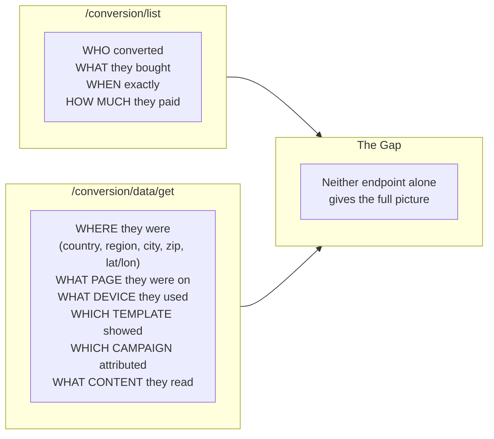
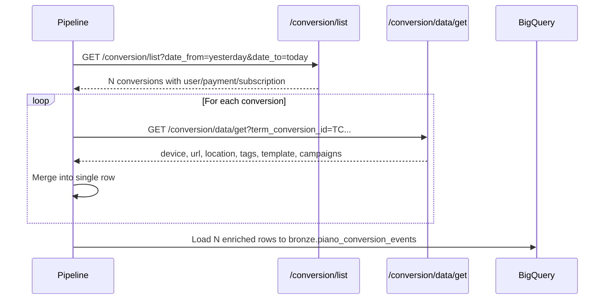
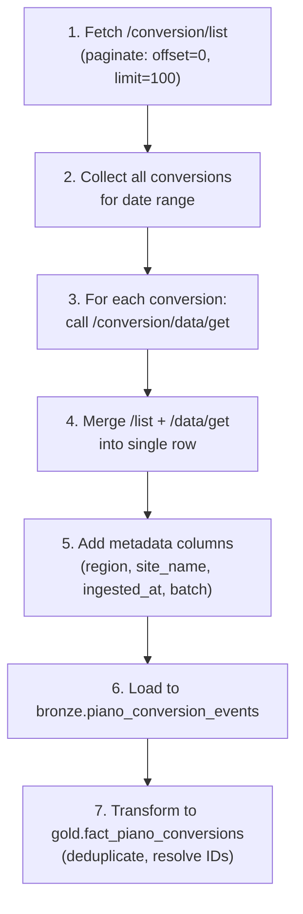

# Conversion Enrichment Strategy

> How to combine `/conversion/list` + `/conversion/data/get` to create a complete event-level dataset.

## The Problem

The Piano API splits conversion data across two complementary endpoints:



## The Solution: Enrich



## Join Key

The join between the two endpoints is on `term_conversion_id`:

```
/conversion/list  ──── term_conversion_id ────  /conversion/data/get
     (1:1 relationship)
```

Every conversion from `/list` should have exactly one `/data/get` record.

## Merged Output Schema

After enrichment, each row contains fields from both sources:

| Field | Source | Description |
|-------|--------|-------------|
| `term_conversion_id` | /list | Primary key |
| `type` | /list | Registration / Dynamic |
| `create_date` | /list | Epoch timestamp |
| `uid` | /list | User ID |
| `user_email` | /list | User email |
| `user_first_name` | /list | |
| `user_last_name` | /list | |
| `term_id` | /list | Term ID |
| `term_name` | /list | Term display name |
| `term_type` | /list | registration / dynamic |
| `resource_name` | /list | Resource name |
| `access_id` | /list | Access grant ID |
| `access_granted` | /list | Boolean |
| `subscription_id` | /list | null for registrations |
| `subscription_status` | /list | |
| `subscription_auto_renew` | /list | |
| `payment_amount` | /list | null for registrations |
| `payment_currency` | /list | |
| `payment_method` | /list | |
| `promo_code` | /list | |
| `period_name` | /list | |
| `aid` | **/data/get** | Application ID |
| `url` | **/data/get** | Page URL |
| `browser` | **/data/get** | Browser name |
| `platform` | **/data/get** | Device type |
| `operating_system` | **/data/get** | OS name |
| `user_country` | **/data/get** | Country |
| `user_region` | **/data/get** | Region/state |
| `user_city` | **/data/get** | City |
| `zip` | **/data/get** | Zip code |
| `latitude` | **/data/get** | Geo coordinate |
| `longitude` | **/data/get** | Geo coordinate |
| `user_agent` | **/data/get** | Full UA string |
| `locale` | **/data/get** | User locale |
| `hour` | **/data/get** | Hour of conversion |
| `tags` | **/data/get** | Content tags |
| `template_id` | **/data/get** | Template ID |
| `offer_id` | **/data/get** | Offer ID |
| `offer_template_id` | **/data/get** | Offer template ID |
| `campaigns` | **/data/get** | Campaign codes |
| `content_author` | **/data/get** | Article author |
| `content_section` | **/data/get** | Article section |
| `content_created` | **/data/get** | Article publish date |

## Rate Limiting Considerations

The `/conversion/data/get` endpoint requires **one API call per conversion**:

| Daily conversions | API calls needed | Estimated time |
|-------------------|------------------|----------------|
| 13–59 (Cosmopolitan) | 13–59 | Seconds |
| ~1,000+ (Quest, estimated) | ~1,000+ | Minutes |

> **Rate limits are not documented by Piano.** The estimates below are conservative defaults. Implement exponential backoff on HTTP 429 responses and monitor `X-RateLimit-*` headers if present.

### Recommended approach:

```python
import time

def enrich_conversions(aid, conversions, delay=0.2):
    enriched = []
    for i, conv in enumerate(conversions):
        tc_id = conv["term_conversion_id"]
        data = fetch_conversion_data(aid, tc_id)
        merged = {**flatten_conversion(conv), **data}
        enriched.append(merged)

        if (i + 1) % 50 == 0:
            print(f"  Enriched {i+1}/{len(conversions)}")
        time.sleep(delay)

    return enriched
```

- Default delay: **200ms** between calls (~5 req/s) — conservative until rate limits are confirmed
- Implement exponential backoff on 429 responses
- For large volumes (>1000/day), consider batching or caching

## What This Replaces

With enriched conversion events in BQ, you can now answer questions that previously required querying both the aggregate CSVs AND guessing:

| Question | Before (aggregate CSVs) | After (enriched events) |
|----------|------------------------|------------------------|
| "Which pages generate the most revenue?" | Impossible (no payment data per page) | `SELECT url, SUM(payment_amount) GROUP BY url` |
| "What device do churned users use?" | Impossible (no user-level data) | Join with subscription status |
| "Do promo users convert from different pages?" | Impossible | `WHERE promo_code IS NOT NULL GROUP BY url` |
| "Revenue by country?" | Impossible | `SELECT user_country, SUM(payment_amount)` |
| "How many registrations from mobile vs desktop?" | Impossible (exports mix types) | `WHERE type='Registration' GROUP BY platform` |

## What This Does NOT Replace

The 9 aggregate export CSVs should be **kept** for one reason:

**Exposures (paywall impressions)**

This metric counts how many users *saw* the paywall but did NOT convert. It is tracked by Piano's frontend JavaScript and is not available in any API. The conversion rate = Conversions / Exposures.

Use case: "We showed the paywall 1,018,340 times on mobile/android/chrome, and only 229 converted (0.02% rate). Should we optimize the mobile paywall?"

This question can ONLY be answered with the export CSVs.

## Pipeline Implementation Flow


