# Migration Impact Analysis

> How existing tables are affected, what is added, what is deprecated, and before/after comparison.

## Summary of Changes

```mermaid
flowchart LR
  subgraph before ["BEFORE (Current State)"]
    direction TB
    B1["bronze.piano_reports_subscription_log"]
    B2["bronze.piano_reports_conversion_device"]
    B3["bronze.piano_reports_conversion_page"]
    B4["bronze.piano_reports_conversion_location"]
    B5["bronze.piano_reports_conversion_tag"]
    B6["bronze.piano_reports_conversion_template"]
    B7["bronze.piano_reports_conversion_term"]
    B8["bronze.piano_reports_conversion_term_type"]
    B9["bronze.piano_reports_conversion_promotion"]
    B10["bronze.piano_reports_conversion_campaign_codes"]
  end

  subgraph after ["AFTER (New State)"]
    direction TB
    A1["bronze.piano_reports_subscription_log\n(UNCHANGED)"]
    A2["bronze.piano_conversion_events\n(NEW - enriched)"]
    A3["bronze.piano_reports_conversion_*\n(9 tables, UNCHANGED)"]
    A12["gold.fact_piano_conversions\n(NEW)"]
    A13["gold.fact_piano_subscriptions\n(NEW)"]
    A14["gold.fact_piano_exposures\n(NEW)"]
    A15["gold.dim_piano_terms\n(NEW)"]
    A16["gold.dim_piano_resources\n(NEW)"]
    A17["gold.dim_piano_promotions\n(NEW)"]
  end
```



---

## Existing Tables: What Happens to Them

### `piano_reports_subscription_log` — UNCHANGED

No changes to name, schema, source, or load pattern. Continues as-is.

### `piano_reports_conversion_*` (9 tables) — UNCHANGED

All 9 aggregate CSV tables (`piano_reports_devices`, `piano_reports_locations`, `piano_reports_pages`, etc.) continue as-is. They remain the only source for **Exposures** (paywall impression counts). No renaming required at this stage.

### No tables are DELETED or DEPRECATED

All existing data sources continue to run. The enrichment adds a new parallel path -- it does NOT replace the existing ingestion.

---

## New Tables: What Is Added

### NEW: `bronze.piano_conversion_events`

| Aspect | Detail |
|--------|--------|
| **Purpose** | Event-level conversion data with full behavioral context |
| **Source** | `/conversion/list` enriched with `/conversion/data/get` |
| **Grain** | 1 row per conversion event |
| **Columns** | ~55 columns (see TABLE_SCHEMAS.md) |
| **Key columns** | `term_conversion_id` (PK), `uid`, `term_id`, `subscription_id`, `url`, `platform`, `user_country`, `payment_amount` |
| **Load pattern** | Daily append, partitioned by `report_date` |
| **Expected volume** | ~50-1,100 rows/day per AID |

**What this adds that didn't exist before:**

- Individual conversion events with user identity (uid, email) linked to behavioral context (page, device, location)
- Registration conversions (previously only in aggregate CSVs with no user detail)
- Revenue per page / per location / per device (previously impossible)
- Geo coordinates (latitude, longitude, zip) per conversion
- Content metadata (author, section, created date) per conversion
- User agent string per conversion
- Hour-of-day per conversion

### NEW: `gold.fact_piano_conversions`

| Aspect | Detail |
|--------|--------|
| **Purpose** | Clean, deduplicated, business-ready conversion facts |
| **Source** | `bronze.piano_conversion_events` |
| **Transform** | Dedup by `term_conversion_id`, resolve IDs to names via dims, exclude PII |
| **Key joins** | `term_id` -> `dim_piano_terms`, `promo_code` -> `dim_piano_promotions` |

### NEW: `gold.fact_piano_subscriptions`

| Aspect | Detail |
|--------|--------|
| **Purpose** | Clean subscription facts with boolean flags |
| **Source** | `bronze.piano_reports_subscription_log` |
| **Transform** | Normalize status strings to booleans, exclude PII/address fields, resolve IDs |
| **Key joins** | `term_id` -> `dim_piano_terms`, `subscription_id` -> `fact_piano_conversions` |

### NEW: `gold.fact_piano_exposures`

| Aspect | Detail |
|--------|--------|
| **Purpose** | Unified exposure metrics across all 9 dimensions |
| **Source** | 9 `bronze.piano_reports_conversion_*` tables |
| **Transform** | Pivot 9 tables into 1 with `dimension_type` column |
| **Benefit** | One table to query instead of 9. Easy to add new dimensions. |

### NEW: `gold.dim_piano_terms`

| Aspect | Detail |
|--------|--------|
| **Purpose** | Resolve `term_id` to display names, pricing, type |
| **Source** | `/api/v3/publisher/term/list` |
| **Refresh** | Weekly full replace |

### NEW: `gold.dim_piano_resources`

| Aspect | Detail |
|--------|--------|
| **Purpose** | Resolve `rid` to resource names and types |
| **Source** | `/api/v3/publisher/resource/list` |
| **Refresh** | Weekly full replace |

### NEW: `gold.dim_piano_promotions`

| Aspect | Detail |
|--------|--------|
| **Purpose** | Resolve promo codes to discount details |
| **Source** | `/api/v3/publisher/promotion/list` |
| **Refresh** | Weekly full replace |

---

## Before vs After: What Questions Can Be Answered

### Questions answerable BEFORE (with current tables only)

| Question | Source |
|----------|--------|
| How many conversions by device/page/location/tag? | Aggregate CSVs |
| What is the conversion rate by template? | Aggregate CSVs |
| How many exposures (paywall views) per dimension? | Aggregate CSVs |
| What is a subscriber's billing history? | Subscription log |
| Which subscribers are in grace period? | Subscription log |
| Which payment source do subscribers use? | Subscription log |
| How many logins/sessions in last 30 days? | Subscription log |

### Questions answerable AFTER (with new enriched tables)

| Question | Source | Why it's new |
|----------|--------|-------------|
| Which specific users converted on which pages? | `fact_piano_conversions` | Aggregate CSVs had no user identity |
| Revenue per page URL? | `fact_piano_conversions` | No payment data in aggregate CSVs |
| Revenue per country/region? | `fact_piano_conversions` | No payment data in location CSV |
| Which promo codes work best on which pages? | `fact_piano_conversions` | No promo + page combo before |
| Registration vs paid conversion by device? | `fact_piano_conversions` | Aggregate CSVs mixed types |
| User journey: registration -> paid subscription? | `fact_piano_conversions` JOIN `fact_piano_subscriptions` on `uid` | No uid linkage before |
| Which content authors drive the most conversions? | `fact_piano_conversions` | `content_author` is new |
| What hour of day has the highest conversion rate? | `fact_piano_conversions` | `hour` is new |
| Geo-map of conversions with lat/lon? | `fact_piano_conversions` | Coordinates are new |
| Term pricing vs actual revenue? | `fact_piano_conversions` JOIN `dim_piano_terms` | Pricing in dim, revenue in fact |
| Promotion discount effectiveness? | `fact_piano_conversions` JOIN `dim_piano_promotions` | Discount details in dim |

### Questions that STILL require aggregate CSVs

| Question | Why |
|----------|-----|
| How many users **saw** the paywall (Exposures)? | Only in VX export |
| What is the conversion rate (Conversions / Exposures)? | Requires Exposures |
| Logins / Sessions / Pageviews per subscriber | Only in subscription log export |
| Experience ID / Name | Only in subscription log export |

---

## Pipeline Changes

### Current pipeline (Airflow DAG: `piano_reporting_{tenant}`)

```
K8 IngestReportsToGCS → K8 LoadGCSReportsToBQ (bronze)
  → TransformBronzeToSilver (BQ SQL)
  → DataQualityCheck (BQ SQL)
  → PromoteSilverToGold (BQ SQL)
  → [DimSubscribers | DimRevenue | DimChurn | DimConversions] (parallel BQ SQL)
  → ClearSilverData (BQ SQL)
```

The K8 steps run in a container (`piano-reporting`). The BQ SQL steps run directly from Composer.

### New pipeline (add one K8 step)

```
K8 IngestReportsToGCS → K8 LoadGCSReportsToBQ (bronze, unchanged)
  → TransformBronzeToSilver (unchanged)
  → DataQualityCheck (unchanged)
  → PromoteSilverToGold (unchanged)
  → [DimSubscribers | DimRevenue | DimChurn | DimConversions] (unchanged)
  → ClearSilverData (unchanged)

K8 IngestConversionEvents (NEW, parallel with above)
  → Call /conversion/list for yesterday's date
  → For each conversion, call /conversion/data/get
  → Merge into single rows
  → Load to bronze.piano_conversion_events

Weekly: RefreshDimensions (NEW, separate DAG or task)
  → Call /term/list, /resource/list, /promotion/list
  → Full replace into gold.dim_* tables
```

---

## Rollback Plan

If the enrichment has issues, the existing pipeline is completely unaffected:
- Subscription log ingestion: unchanged
- 9 aggregate CSV ingestion: unchanged (no table renaming)
- New `piano_conversion_events` table: independent, can be dropped without impact
- Gold tables: new tables only, no impact on existing data
- The new K8 task can be disabled in the DAG without affecting any existing tasks
