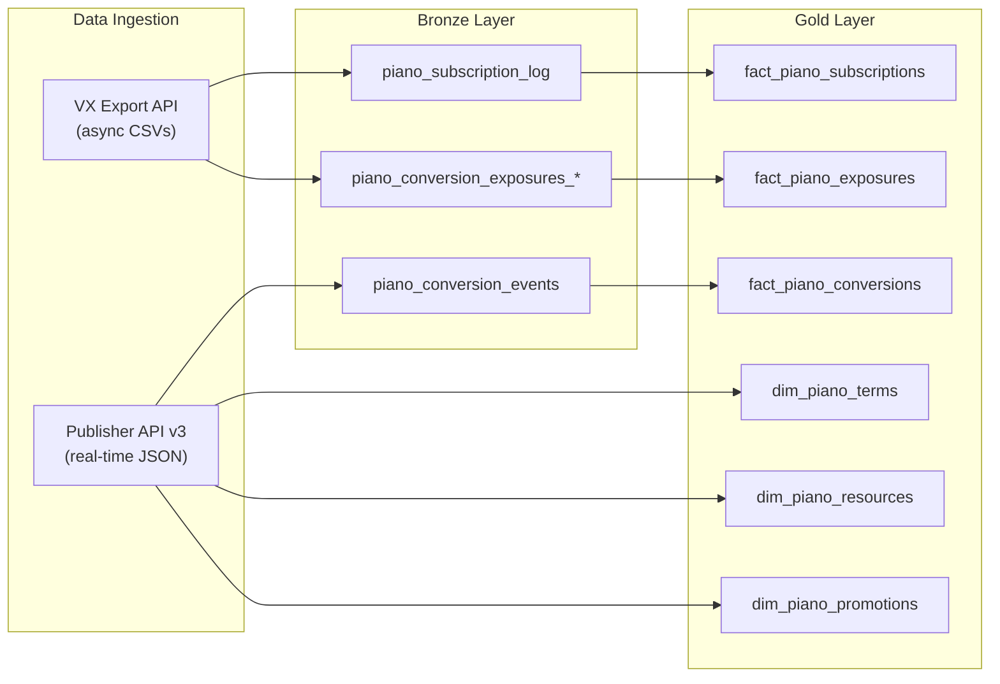

# Piano Data Documentation

> Complete documentation for Piano reporting data pipeline: API reference, data architecture, table schemas, field mappings, and migration plan.

## Quick Overview

---

## Documents

| Document | What it covers |
|----------|---------------|
| [PIANO_API_REFERENCE.md](PIANO_API_REFERENCE.md) | All ~45 API endpoints with method, URL, parameters, response examples, and curl commands |
| [DATA_SOURCES.md](DATA_SOURCES.md) | Every data source inventoried: what fields each provides, what is missing, what is new |
| [DATA_ARCHITECTURE.md](DATA_ARCHITECTURE.md) | Bronze/Gold layer design with mermaid diagrams, dataset organization, data flow timeline |
| [TABLE_SCHEMAS.md](TABLE_SCHEMAS.md) | Complete DDL for all bronze tables (3 types) and gold tables (3 facts + 3 dims) |
| [FIELD_MAPPING.md](FIELD_MAPPING.md) | Field-by-field mapping from every CSV column to API endpoint to BQ column |
| [ENRICHMENT_STRATEGY.md](ENRICHMENT_STRATEGY.md) | How `/conversion/list` + `/conversion/data/get` combine to create enriched events |
| [MIGRATION_IMPACT.md](MIGRATION_IMPACT.md) | Impact on existing tables, what is added/renamed, before vs after, rollback plan |

---

## Key Discovery

The `/api/v3/publisher/conversion/data/get` endpoint provides **per-conversion behavioral context** (device, page, location, tags, template, campaigns) using the `term_conversion_id` from `/conversion/list`.

By combining these two endpoints:
- `/conversion/list` = WHO converted + WHAT they paid + WHEN
- `/conversion/data/get` = WHERE (page, location) + HOW (device) + WHY (template, campaign, tags)

We get a **complete event-level dataset** that is richer than all 9 aggregate export CSVs combined, with the only exception being **Exposures** (paywall impression counts), which remain export-only.

---

## What Is New vs Current

| Capability | Current (exports only) | New (with enrichment) |
|-----------|----------------------|----------------------|
| Revenue per page | Not possible | `payment_amount` + `url` per event |
| Revenue per country | Not possible | `payment_amount` + `user_country` per event |
| User identity on conversions | Not possible (aggregated) | `uid` + `email` per conversion |
| Registration conversions with context | No user data | Full user + page + device per registration |
| Geo coordinates | Not available | `latitude`, `longitude`, `zip` per event |
| Content metadata | Not available | `content_author`, `content_section` per event |
| Promo effectiveness by page | Not possible | `promo_code` + `url` + `payment_amount` |
| User journey tracking | Not possible | `uid` links registrations to subscriptions |
| Exposures (paywall views) | Available | Still export-only (kept) |
| Engagement metrics (logins/sessions) | Available | Still export-only (kept) |

---

## Table Count Summary

| Layer | Existing Tables | New Tables | Renamed Tables | Total |
|-------|----------------|------------|----------------|-------|
| Bronze | 10 | 1 | 10 (name change only) | 11 |
| Gold | 0 | 6 | 0 | 6 |
| **Total** | **10** | **7** | **10** | **17** |

---

## Pipeline Architecture

| Pipeline Step | Frequency | Source | Target | Status |
|--------------|-----------|--------|--------|--------|
| Ingest VX subscription log | Daily | `reports-api.piano.io` | GCS -> `bronze.piano_subscription_log` | In production |
| Ingest VX conversion export | Daily | `reports-api.piano.io` | GCS -> `bronze.piano_conversion_exposures_*` | In production |
| Enrich conversion events | Daily | `/conversion/list` + `/conversion/data/get` | `bronze.piano_conversion_events` | To implement |
| Sync dimension tables | Weekly | `/term/list`, `/resource/list`, `/promotion/list` | `gold.dim_piano_*` | To implement |
| Transform to gold facts | Daily | Bronze tables | `gold.fact_piano_*` | To implement |

---

## AIDs in Scope

| AID | Site | Locale | Has Subscriptions | Has Registrations |
|-----|------|--------|-------------------|-------------------|
| B3HsDWtPpe | Quest | NL | Yes (~2,930 subs) | Yes |
| JC6giZ1Ape | Cosmopolitan | NL | No (registration-only) | Yes (~47/day) |

---

## Environment Configuration

| Environment | Project | Dataset (Bronze) | Dataset (Gold) | API Base URL |
|-------------|---------|-----------------|---------------|--------------|
| Production | `hmm-hmi-piano-reporting` | `bronze` | `gold` | `https://dashboard-eu.piano.io/api/v3/` |
| Development | `hmm-hmi-data-feature` | `bronze` | `gold` | `https://dashboard-eu.piano.io/api/v3/` |
